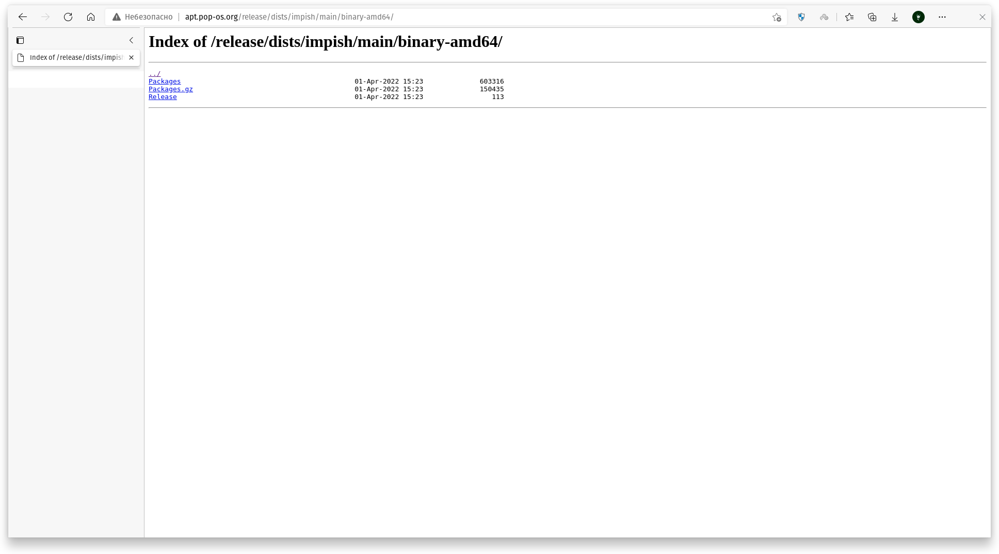
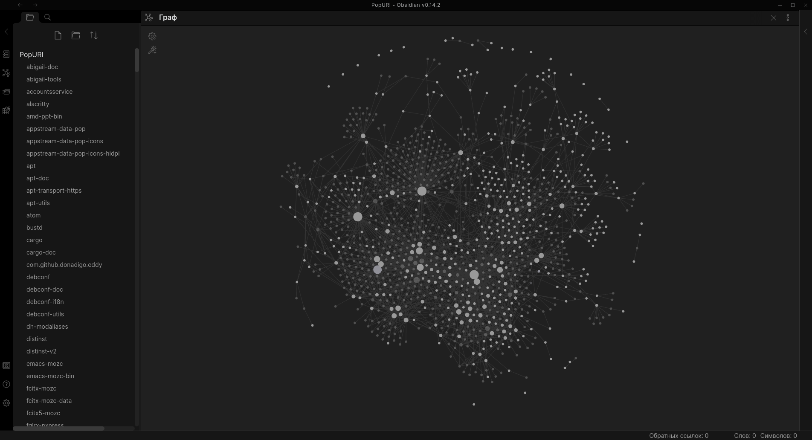

# parse-packages-to-obsidian-uri
Скриптик-парсер, выполняющий парсинг содержимого файла Packages из репозиториев в формат, подходящий для создания графов в Obsidian.

## Порядок использования:
1. Скачиваем файл Packages из какого-либо репозитория (не знаю, совместимы ли они друг с другом, если да, то наше счастье). Пример местоположения файла приведён на рисунке 1 ниже.

Рисунок 1. Местоположение файла Packages

2. Добавляем в параметры запуска программного средства два параметра: местоположение входного файла и местоположение папки, в которую будет производиться сохранение форматированного содержимого файла Packages. Описание в коде расположено ниже.
    ```kotlin
    /**
     * Входные параметры:
     * args[0] - путь до файла, в котором лежит информация о пакетах в репе.
     * args[1] - папка, в которую будет осуществляться вывод содержимого.
     * Здесь нужна бы проверка условий, но так как для себя, то можно:)
     */
    fun main(args: Array<String>) {
        println("Program arguments: ${args.joinToString()}")
    
        val inputPath = args[0]
        val outputPath = args[1]
    
        createFiles(inputPath, outputPath)
    }
    ```

3. Выполняем скрипт, открываем через Obsidian папку как новое хранилище, нажимаем по кнопке "Граф" и любуемся построенным графом. Пример на рисунке 2 ниже.
